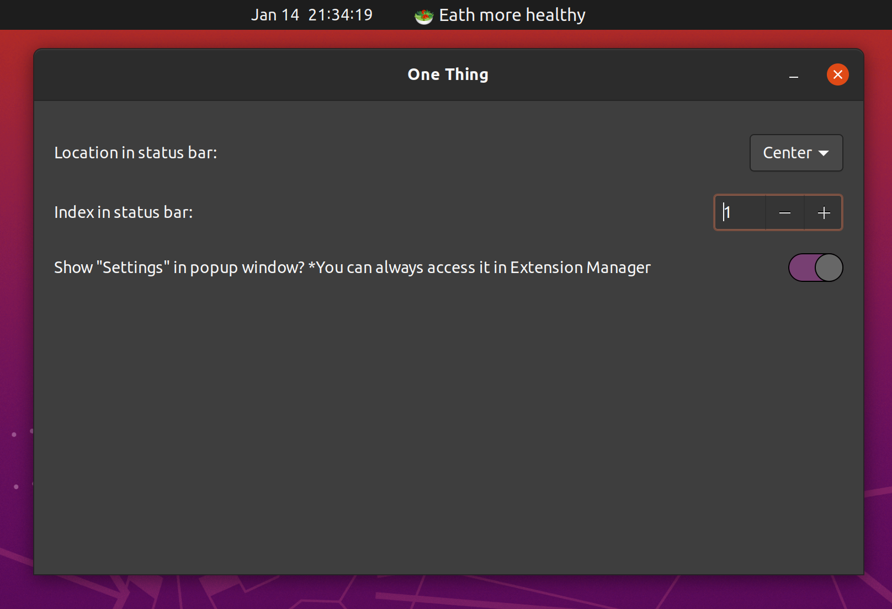

# One-Thing Gnome Extension

> Put a single task or goal in your menu bar.

One-Thing is a productivity tool that helps you stay focused on one task at a time.

### Install

You can install this extension from the gnome extension store: https://extensions.gnome.org/extension/5072/one-thing/

### Screenshots

- **Task View**:

  

- **Edit Task**: Easly edit your task.

  


- **Preferences Window**: You can control the position of the task in the top bar

  

## Development

### Create Zip File to be published

```
zip -r one-thing@github.com.zip * -x .git/* .github/* Makefile
```

### Manual installation notes (great for development)

- Run **make** (or **make all**) from the project folder to compile the schema
- Place the folder in **~/.local/share/gnome-shell/extensions**
- Rename the folder to **one-thing<span>@</span>github.com** so the gnome
  shell will find it
- Makefile, .gitignore and this file can be deleted (optional)
- Reset the gnome shell (if under X11 then press **Alt-F2** and then submit the
  **r** command; else if under Wayland then log out and log back in)
