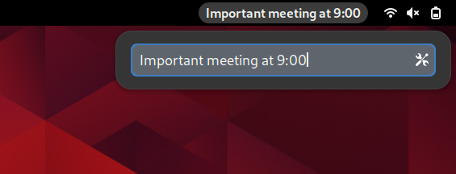

# One Thing Gnome Extension

Put a single task or goal in your menu bar.

### Screenshots


---



### Create Zip File

```
zip -r one-thing@github.com.zip * -x .git/* .github/* Makefile
```

### Manual installation notes

- Run **make** (or **make all**) from the project folder to compile the schema
- Place the folder in **~/.local/share/gnome-shell/extensions**
- Rename the folder to **one-thing<span>@</span>github.com** so the gnome
  shell will find it
- Makefile, .gitignore and this file can be deleted (optional)
- Reset the gnome shell (if under X11 then press **Alt-F2** and then submit the
  **r** command; else if under Wayland then log out and log back in)
